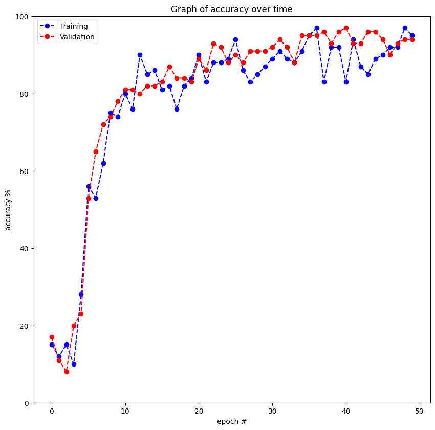
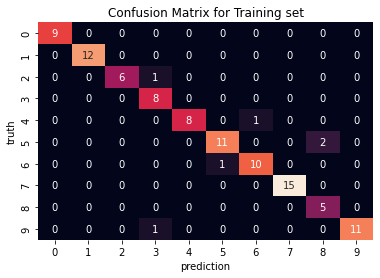
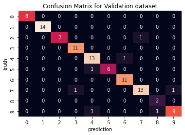

# PyTorch-ViT-Vision-Transformer
## Introduction
PyTorch implementation of the Vision Transformer architecture using this paper: https://arxiv.org/pdf/2010.11929.pdf. This architecture is trained with a basic MNIST placeholder to test that it works. Ideally you would do a grid search for finding hyperparameters, especially transformations, and you would use such architectures for more complicated datasets, however, this is out of scope for this repo. You can also add whatever classification head you want, including random forests, with good results. 

**To-do:** display attention as images  
**To-do:** display positional embeddings as images  
**To-do:** test on more difficult datasets

## Methodology
To give a rough overview, ViT works by splitting an image into patches which are embedded with a linear layer. I decided to implement this using a 2d convolution with a single kernel. A classification token is then preappended to the input to be used for classification at the end. The final 'preprocessing' is to add trainable positional embeddings. This can be substituted for embeddings generated using sinusoidal functions, but I decided to opt for the technique with a weaker inductive prior. The encoded input is then put through a chain of encoders, with the vector of the classifier token being fed as input to a lightweight classifier head. The encoders themselves use **attention**, which means that the receptive field of the patches is higher than in CNNs, as each patch can see all other patches even in the first encoder. The way attention works, to keep the explanation is short, is that it takes the input and gets 3 linear projections per token (encoded patch) - the query, key and value. The keys tell us about a token that we want to compute the attention of, the queries and keys form a kind of a lookup table where each query maps to a key. Then, each token uses its key and multiplies it with the  query tokens - similar keys and queries will result in a higher score. Then, the scores (which tell us how important a token is to another one) are multiplied with the values (useful context-based patterns) to generate attention that is used in the final feed-forward layers of the encoder. 

## Results 
*Using MNIST with a shallow network and a very small number of batches per epoch due to lack of resources.*  

